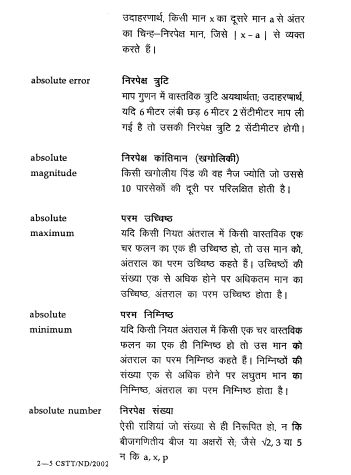
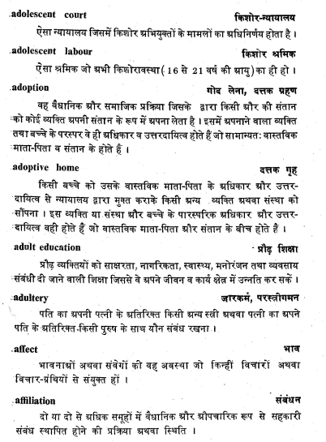
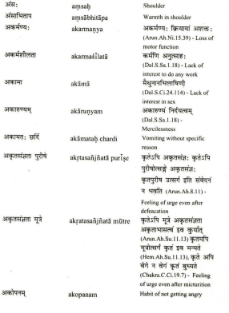
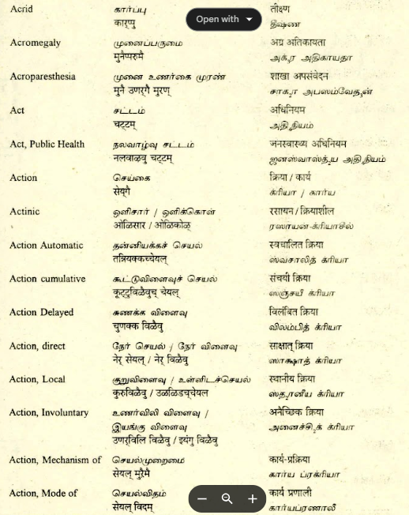
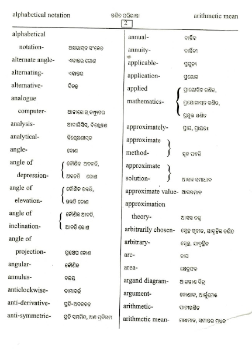
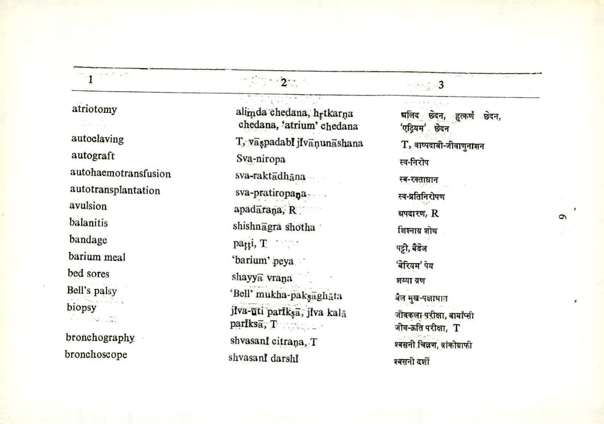
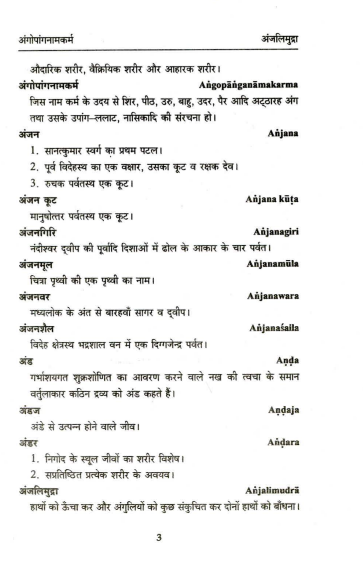

# cstt-ocr-usecase

## Installation steps


```
pip install -r requirements.txt
brew install tesseract
brew install poppler
```

## Execution Command

<pre>
python main.py -i <strong>INPUT_PDF_or_IMAGE_PATH</strong> -im <strong>TYPE_of_INPUT</strong> -l <strong>LANGUAGE_MODEL</strong> -m <strong>MODE_OF_EXTRACTION</strong> -s <strong>START_PAGE</strong> -e <strong>END_PAGE</strong>
</pre>

## Different Modes of Execution


| Mode 1                  | Mode 2                  | Mode 3                  |
|-------------------------|-------------------------|-------------------------|
|  |  |  |

| Mode 4                 | Mode 5                 | Mode 6                 |
|-------------------------|-------------------------|-------------------------|
|  |  |  |

| Mode 7                 |Mode 8                  |
|-------------------------|-------------------------|
|  |  |


## Authors

-  🌺 Badri Vishal Kasuba, MS Student
-  🌺 Shourya Tyagi, Intern
-  🌺 Pranav Dalvi, Intern